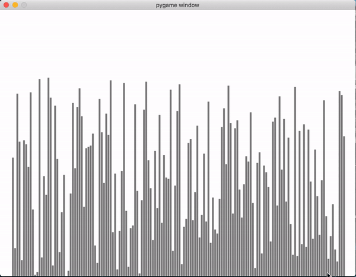

# Visualizing Sorting Algorithms

## Objective:
### Use Pygame to visualize the following sorting algorithms:
#### 1. Merge Sort
#### 2. Heap Sort
#### 3. Quick Sort
#### 4. Bubble Sort

Demo: https://youtu.be/Pcrj5vNqLNY

## How to use:
#### 1. install libraries: pip install -r requirements.txt
#### 2. run: python sorting.py (select the different algorithms to visualize in the main function)
